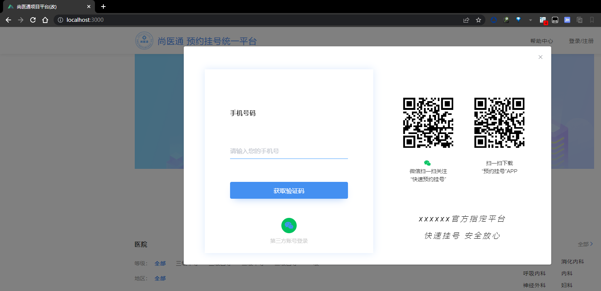

## 项目背景
尚医通即为网上预约挂号系统，网上预约挂号是近年来开展的一项便民就医服务，旨在缓解看病难、挂号难的就医难题，许多患者为看一次病要跑很多次医院，最终还不一定能保证看得上医生。网上预约挂号全面提供的预约挂号业务从根本上解决了这一就医难题。随时随地轻松挂号！不用排长队！
## 项目构成
> yyph_parent整合了很多模块,为两套系统[yygh-site](https://github.com/Pronting/yygh_demo/tree/master/yygh-site)以及[vue-admin-template-master](https://gitee.com/pronting/yygh_parent_q)提供了后台逻辑处理
其中yyph-site为用户系统，主要进行用户的查看医院信息，预约排班，挂号缴费等功能。vue-admin-template-master主要是root管理。

## 主要技术栈
1. **SpringBoot**：简化新Spring应用的初始搭建以及开发过程
2. **SpringCloud**：基于Spring Boot实现的云原生应用开发工具，SpringCloud使用的技术：（SpringCloudGateway、Spring Cloud Alibaba Nacos、Spring Cloud Alibaba Sentinel、SpringCloud Task和SpringCloudFeign等）
3. **MyBatis-Plus**：持久层框架
4. **Redis**：内存缓存
5. **RabbitMQ**：消息中间件
6. **HTTPClient**: Http协议客户端
7. **Swagger2**：Api接口文档工具
8. **Nginx**：负载均衡
9. **MongoDB**：面向文档的NoSQL数据库

 _项目架构图_

 _项目流程图_

## 项目参数修改
请注意，在此之前，请先准确无误的运行前台项目[vue-admin-template-master](https://gitee.com/pronting/yygh_parent_q)

`npm install` 下载前台依赖后然后 `npm run dev`  运行前台系统

请将*每个*模块`application.properties`如下相关配置修改为自己电脑的配置
* nacos地址修改
* mongodb地址修改
* RabbitMQ地址修改
* GateWay地址修改
* Mysql地址修改

## 注意事项
1. 在启动各个微服务之前，请先启动Nacos
2. 在启动Gateway之前，请先启动各个微服务
3. 请根据实际情况修改Nacos的配置文件
4. 请根据实际情况修改Gateway的配置文件
5. 接口测试为每一个服务的swagger地址
6. 请确保将后台的每一个服务正确打开无误

## 已实现的模块包括：

* | 名称                 | 描述                 | 功能                     |  
  |:-------------------|:-------------------|:-----------------------|  
  | service_cmn        | 整个项目的字典基准数据        | 为其他服务以及菜单提供基本数据        |
  | service_hosp       | 医院服务包括部门，排班信息，科室管理 | 同描述                    |   
  | service_msm        | 项目的短信通知            | 主要用来用户登录，以及定时任务等       |
* | service_order      | 整个项目的订单服务          | 包括生成订单，收款退款，取消预约信息等    |
* | service_oss        | oss 模块             | 用户头像上传                 |
* | service_statistics | 项目的统计服务            | 统计各个医生每天号源以及预约人数       |
* | service_user       | 用户模块               | 主要是用户权限校验，token认证，登录等等 |
* | service_gateway    | 项目统一网关             | 将请求转发给对应的服务中去          |
* | common             | 工具模块               | 全局异常，枚举，注解，配置等等        |
* | service_client     | 模块远程调用客户端          | 同描述                    |

## 系统操作流程(项目启动成功之后)
### 登录manager 服务，设置医院信息
> 医院code：1000_0 
> 签名key：880189488a80a9d7851d63240fd22aba 
> 基础路径：http://localhost:8201

### 导入医院数据

### 添加科室信息
> 找到sql目录下的`department.json`复制粘贴-科室列表

### 添加排班信息
> 找到sql目录下的`schedule.json` 复制粘贴-排班列表

 

### 登录`yyph-site`，这里采用手机登录
> 使用手机号或者微信登陆(目前是模拟发送短信, 在service_msm中可自行打开注释. 微信登陆使用谷粒学院的key和secret)

 
> **请注意** 请自备阿里云短信服务，在`service_msm`中的`application.properties`中修改成你的id以及密钥

### 完成实名认证
> 新手机号注册必须完成实名认证，否则预约付款等操作无法进行,**实名注册入口在右上角下拉菜单里**

#### 登陆到admin, 通过认证
> 请运行`hospital_manager`模块并运行对应的前台项目

### 下单流程
#### 添加就诊人

#### 回到科室页，找到多发性硬化专科门诊科室(仅此科室有正确的时间数据)[**请将时间调整为2023/1/***]左右

#### 进行挂号

#### 进行支付(目前3秒轮询查询订单状态, 待已支付后窗口关闭)

### 退单流程
> 退单逻辑在`OrderService-cancelOrder`, 可自行将时间限定注释打开。

